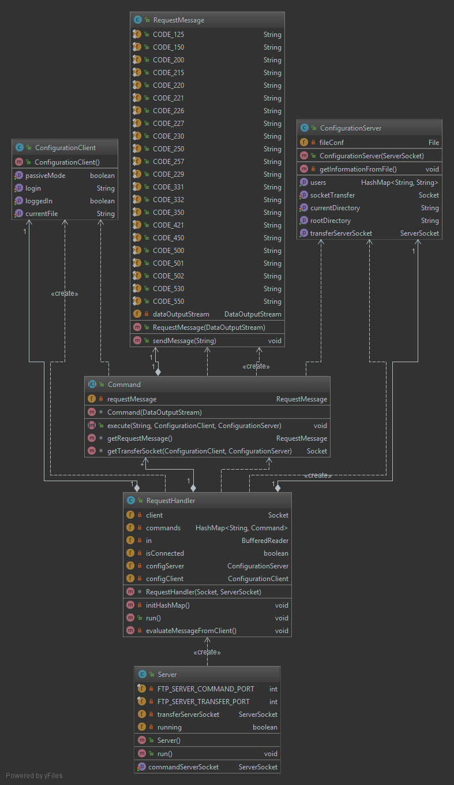
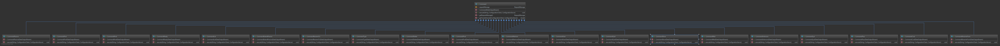

TP1 : serveur FTP
===================

----------

 Bienvenue sur notre serveur FTP. Mini projet réalisé dans le cadre de la Construction d'Application Repartie par Irakoze Franco Davy et Leprêtre Guillaume. Dans ce tp, vous trouverez un serveur FTP

# Composition du TP :

- Un projet `Maven` regroupant notre projet FTP
- Le code source se trouve dans `src/main`
- Les tests unitaire dans `src/test`
- Les diagammes de classe dans `/diagrams`
- Un fichier de config dans `fileConf.txt`
- Le dossier d'accès par le client `/myFTPDirectory` permettant de stocker/transférer ce qu'il veut
- Ainsi que le `README.md` de ce tp

# Mise en place du TP :

- Télécharger l'archive à l'aide de la commande `git clone`
- Compiler les différents modules avec la commande `mvn package` ou `mvn clean install`
- Vous pouvez générer la javadoc avec la commande `mvn javadoc:javadoc`
- Pour lancer le programme, situé vous à la racine du module à savoir `CAR-FTP`
- Exécuter la commande suivante `java -jar target/CAR-FTP-1.0-SNAPSHOT.jar repository`

# Diposition des classes :

Vous pouvez voir ci-dessous l'architecture de notre projet : 

## Code Samples:

### Fonctionnement du server FTP  
Comme vous avez pu le voir, la classe principale  est `Server`. Elle est composé de deux objets `ServerSocket`, une pour les commandes et une pour le transfert de fichiers.  
Cette classe hérite de `Runnable`, permettant de gérer plusieurs connexions.  Lorsqu'une connexion est établie, la classe `RequestHandler` s'occupe de capturer les commandes envoyés par le client et de les traiter si celui-ci la reconnait.  
On y trouve deux configurations, une pour le `client`, une pour le `serveur` permettant de passer les données à travers les différentes commandes.

### Les commandes
Chaque commandes sont définis par une classe qui implémente la classe abstraite `Command` et sont stockés dans une Hashmap, présent dans `RequestHandler`.  
Ainsi, vous pouvez voir l'ensemble des commandes mis en place ci-dessous :  

 
 Ces commandes ont chacune une seule méthode `execute` qui traite la requête du client et qui renvoie les informations nécessaire à son fonctionnement.  
 Pour cela, nous avons utilisé une classe permettant de gérer les réponses possible à envoyer au client : `RequestMessage`. Elle y répertorie, les différents codes à envoyer au client, pour que celui-ci puisse comprendre ce que nous avons réalisé.
   

# Tests :

## TODO