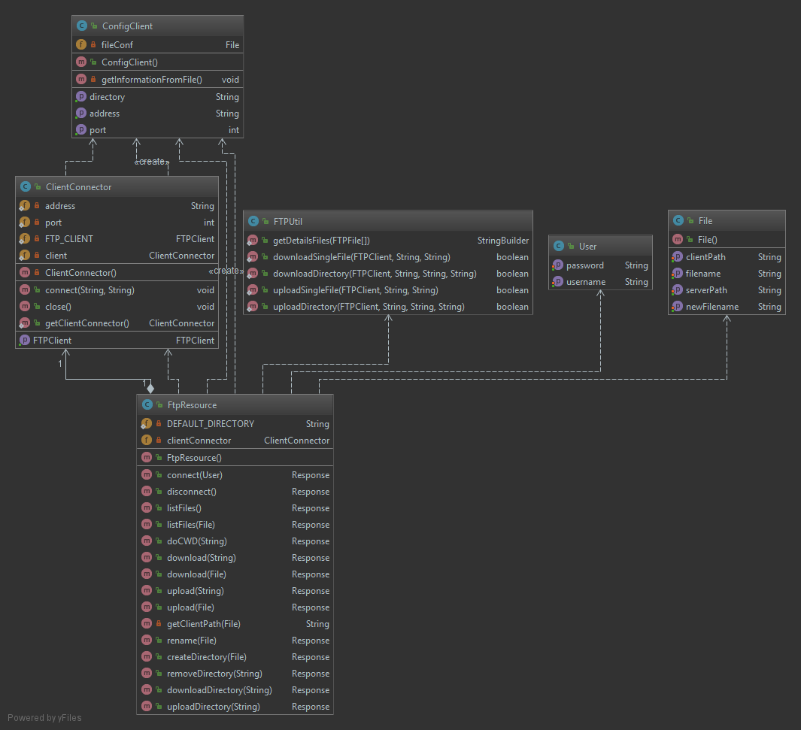

TP2 : Passerelle REST
===================

----------

 Bienvenue sur notre passerelle REST. Mini projet réalisé dans le cadre de la Construction d'Application Repartie par Irakoze Franco Davy et Leprêtre Guillaume.

# Composition du TP :

- Un projet `Maven` regroupant notre projet Passerelle REST
- Le code source se trouve dans `src/main`
- Les tests unitaire dans `src/test`
- Les diagammes de classe dans `/diagrams`
- Un fichier de config dans `fileConf.txt`
- Le dossier de par défault `/files`  permettant d'upload/télécharger des fichiers à travers ce dossier
- Ainsi que le `README.md` de ce tp

# Mise en place du TP :

- Télécharger l'archive à l'aide de la commande `git clone`
- Compiler le projet avec la commande `mvn clean compile"`
- Vous pouvez générer la javadoc avec la commande `mvn javadoc:javadoc`
- Pour lancer le programme, situé vous à la racine du module à savoir `CAR-REST`
- Exécuter la commande suivante `mvn exec:java`

# Disposition des classes :

Vous pouvez voir ci-dessous l'architecture de notre projet : 

# Commandes REST 

Vous pouvez effectuer les commandes suivantes : 

| Commande   | Description                  | Methode    | Commande curl                                                             |
|------------|------------------------------|------------|---------------------------------------------------------------------------|
| CONNECT    | Connexion au serveur         |  POST      | curl -X POST http://localhost:8080/myapp/ftp/connect -H 'Content-Type: application/json' -d '{"username":"anonymous","password":""}'    |
| LIST       |  liste le repertoire courant | GET | curl -X GET http://localhost:8080/myapp/ftp/list HTTP/1.1 Host: localhost:8080  |
| LIST  |  liste le repertoire choisis selon un chemin | POST | curl -X POST http://localhost:8080/myapp/ftp/list -H 'Content-Type: application/json' -d '{"serverPath":"[/path/to/server/]"}' |
| CWD |  change de repertoire  |  GET  | curl -X GET http://localhost:8080/myapp/ftp/cwd/{folder} HTTP/1.1 Host: localhost:8080 |
| CWD | change sur le repertoire parent | GET | curl -X GET http://localhost:8080/myapp/ftp/cwdParent |
| RETRIEVE | Télécharge un fichier du serveur |  GET  | curl -X GET http://localhost:8080/myapp/ftp/download/{filename} HTTP/1.1 Host: localhost:8080 |
| RETRIEVE | Télécharge un fichier du serveur en spécifiant plus de configurations |  POST  | curl -X POST http://localhost:8080/myapp/ftp/download -H 'Content-Type: application/json' -d '{"serverPath":"[/path/to/server]","clientPath":"[/path/to/client]","filename": "[filename]"}' |
| RETRIEVE | Télécharge un dossier complet avec ses sous dossiers depuis le FTP |  GET  | curl -X GET http://localhost:8080/myapp/ftp/downloadDirectory/{folder} HTTP/1.1 Host: localhost:8080 |
| STORE |  Upload un fichier vers le serveur  |  GET  |curl -X GET http://localhost:8080/myapp/ftp/upload/{folder} HTTP/1.1 Host: localhost:8080 |
| STORE |  Upload un fichier vers le serveur en spécifiant plus de configurations  |  POST  |POST /myapp/ftp/upload HTTP/1.1 Host: localhost:8080 Content-Type: application/json { "serverPath":"[path/to/server]", "clientPath":"[path/to/server]", "filename": "[filename]"} |
| STORE | Upload un dossier complet avec ses sous dossiers depuis le FTP  |  GET  | curl -X GET http://localhost:8080/myapp/ftp/uploadDirectory/{folder} HTTP/1.1 Host: localhost:8080 |
| RNTO  | Renomme un dossier ou un fichier |  PUT  | curl -X PUT http://localhost:8080/myapp/ftp/rename -H 'Content-Type: application/json' -d '{ "newFilename": "[newFilename]", "filename": ["gaspard.png"]}' |
| MKD | Crée un nouveau dossier sur le FTP |  POST  | curl -X POST http://localhost:8080/myapp/ftp/create -H 'Content-Type: application/json' -d '{"filename":[folder]}'|
| RMD | Supprime un dossier depuis le FTP |  DELETE  | curl -X DELETE http://localhost:8080/myapp/ftp/remove/{folder} HTTP/1.1 Host: localhost:8080 |
| DELE | Supprime un fichier depuis le FTP |  DELETE  | curl -X DELETE http://localhost:8080/myapp/ftp/removeFile/new.txt |
| DISCONNECT | Le client se déconnecte du serveur FTP |  GET  | GET /myapp/ftp/disconnect HTTP/1.1 Host: localhost:8080 |

# Tests :

## Lancement du serveur FTP
python -m pyftpdlib -w -i "127.0.0.1" -p 8021

## Lancement test
Nous avons implémentés les tests dans le dossier `src/test/`

Pour lancer les tests, vous pouvez faire la commande suivante:
`mvn test`
