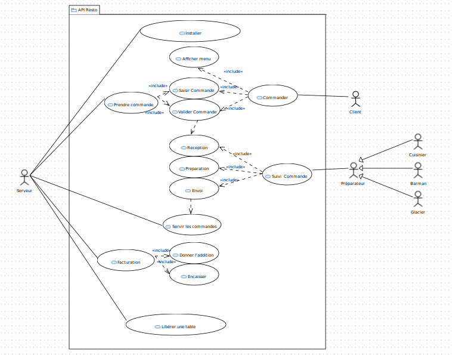

Diagrammes des cas d'utilisation
==========
---
## Cas d'utilisation :

## Description :

Dans ce diagramme de cas d'utilisation, nous pouvons voir le cheminement complet de l'installation des clients jusqu'a la libération de la table

### Commander :

Une commande peut être prise soit par le serveur, soit par le client. Lorsque le serveur prends la commande, il l'a saisit, puis il l'envoie. Lorsque le client prends la commande, c'est le même principe sauf qu'il peux voir le menu sur l'application avant de la saisir.

### Suivi commande :

Le suivie des commandes représente le cheminement de celle-ci par les préparateurs. Tout d'abord, le préparateur reçoit la commande, puis, il l'a passe en préparation, puis une fois prête, il l'envoie.  
Un préparateur peut être un barman, un cuisinier ou un glacier.
Il y a des dépendances à travers le suivie des commandes. En effet, une fois les plats commander, une notification est envoyer aux préparateur, représentant la réception des commandes. Une fois la commande envoyer, un autre dépendance se trouve lorsque le serveur sert les plats.

### Facturation :

Lors de la facturation, il y a deux actions. Tout d'abord, l'addition qui est donnée aux clients en fonction de leurs choix. Ensuite, l'encaissement qui peut être définis sois par carte bancaire, espece, ticket restaurant... etc

## Reflexion de notre CU :

Avant de réaliser notre CU, nous avons réaliser un premier tableau grâce à nos [scénarios](../Scripts/)

|SUJET |TYPE |CONCEPT |
|--------|------|-------------|  
|Serveur |Acteur |Serveur |
|Installer |Action |CU |
|Famille |Acteur |Utlisateur / Client |
|Table |Concept -> Classe | / |
|Libre |Donnée de la Table | / |
|Prendre commande |Action |CU |
|Commande |Concept -> Classe | / |
|Boissons |Concept & donnée de la Commande | / |
|Barman |Acteur |Barman |
|Notification |Objet | / |
|Préparer commande |Action |CU |
|Cuisinier |Acteur |Cuisinier |
|Servir les plats |Action |CU |
|Glacier |Acteur |Glacier |
|Donner l'addition |Action |CU |
|Encaisser |Action |CU |
|Libérer une table |Action |CU |
|Addition |Objet | / |
