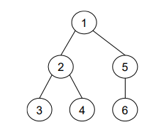
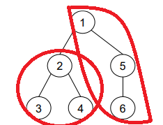

TP3 : Akka
===================

----------

 Bienvenue sur notre application répartit Akka. Mini projet réalisé dans le cadre de la Construction d'Application Repartie par Irakoze Franco Davy et Leprêtre Guillaume. 

# Composition du TP :

- Un projet `Maven` regroupant notre projet FTP
- Le code source se trouve dans `src/main`
- Les tests unitaire dans `src/test`
- Les diagammes de classe dans `/diagrams`
- Ainsi que le `README.md` de ce tp

# Mise en place du TP :

- Télécharger l'archive à l'aide de la commande `git clone`
- Compiler les différents modules avec la commande `mvn clean compile"`
- Vous pouvez générer la javadoc avec la commande `mvn javadoc:javadoc`
- Pour lancer le programme, utilisé la commande suivante `mvn exec:exec`

# Disposition des classes :

Vous pouvez voir ci-dessous l'architecture de notre projet : 

### Fonctionnement du TP

Dans ce TP vous trouverez trois application répartie :

- Un arbre avec un système : 

- Un arbre avec deux systèmes : 

- Un graphe : 

 				

